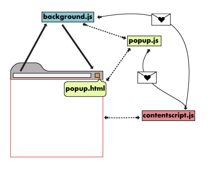

# 크롬 익스텐션(Chrome Extension) 개발

<aside>
💡 해당 문서는 크롬 익스텐션 개발 가이드와 블로그 문서를 참고 하였습니다. 출저는 남겨두었으나, 원저작자의 요청에 따라 글이 내려가거나 변경될 여지가 있으니 참고해주세요.

</aside>

# 기본적인 크롬 익스텐션 구조

출처 : [https://tidyline.gitbook.io/today-i-learned/etc/chromeextension](https://tidyline.gitbook.io/today-i-learned/etc/chromeextension)



기본적으로 스크립트는 `background`, `contentscript`, `popup` 으로 3개로 구성됩니다.

- background : 익스텐션이 실제 동작하는데 필요한 스크립트
- contentscript : 사용자 화면의 DOM과 스크립트를 제어하는 스크립트
- popup : 크롬 익스텐션을 눌렀을 때 뜨는 팝업창과 스크립트

1. 보통의 경우에는 `contentscript` 에서 이벤트 발생 → `background` 에서 listening.

```jsx
// contentscript.js
chrome.runtime.sendMessage({action: "FINISH"}, function(response) {
    alert(response);
});
```

```jsx
// background.js
chrome.runtime.onMessage.addListener(function (request, sender, sendResponse) {
    console.log(sender.tab ?
        "from a content script:" + sender.tab.url :
        "from the extension");

    if (request.action === "FINISH")
        sendResponse({farewell: "goodbye"});
});
```

> chrome.runtime 내부 함수인 `sendMessage`, `onMessage.addListener`를 통해서 이벤트 전달 수행
> 

1. popup 에서 클릭 했을 시에 사용자 화면 변경이 필요하다면...

```jsx
<!--popup.html-->
<button id="start">분석 시작</button>
<script type="text/javascript" src="scripts/popup.js"></script>
```

```jsx
// popup.js
document.getElementById("start").onclick = function () {
    chrome.tabs.query({active: true, currentWindow: true}, function (tabs) {
        chrome.tabs.sendMessage(tabs[0].id, {action: "START"}, /* callback */);
    });
};
```

```jsx
// contentscript.js
chrome.extension.onMessage.addListener(function (msg, sender, sendResponse) {
    if (msg.action === "START") { /* do something */ }
});
```

> 런타임 환경이 아닌 익스텐션에서 메시지를 주고 받는 경우는 `chrome.extension`에 있는 `onMessage.addListener`를 사용해야하며, 탭에 이벤트를 주는 경우에는 tab의 id를 반드시 포함해서 보내주어야한다. (사실 `chrome.tabs` 를 통해 전달할 때에도 tabId를 전달해주어야한다.)
> 

이러한 구조 때문에 

`background.js`와 `contentscript.js`를 **backend** 로,

`popup.html`과 `popup.js`를 **frontend**로 묶어서 작업하는 것으로 보인다.

그래서 frontend에 다양한 웹프레임워크(Vue.js, Angular, React)로 작업을 수행하고,

익스텐션 권한이나 탭 활성화, 실행 시점, 룰과 관련된 것은 `background.js`, 

사용자 DOM 화면과 관련된 것은 `contentscript.js` 

라는 구분된 형식으로 작업을 진행을 하는 양상이 많이 보인다. 

(사실상 백엔드 소스코드에서는 Listener가 대부분의 주요 흐름을 가져간다)

```
# 구조 대략도
/backend                - 백엔드: background, contentscript
 ㄴ background.js
 ㄴ contentscript.js
/frontend               - 프론트엔드: 웹프레임워크로 작업한 popup 소스코드
 ㄴ/public
 ㄴ/src
 ㄴpackage.json
manifest.json           - 크롬 익스텐션 설정 파일
README.md               - 익스텐션 실행 방법 설명 파일
```

> 사용자 화면에서 HTTP 요청에 대해 중간 필터나 훅과 같이 제어를 하려는 경우에는 `persistence:true` 설정을 manifest에서 해줘야한다. 
(자세한 내용은 `chrome.webRequest.onBeforeRequest.addListener` 참고)
> 

> 주의할 것은 프론트(popup)에서 어떤 다른 웹상의 리소스를 가져오려고 하는 경우에 불러와지지 않아 디버깅이 어려운 상황에 놓일 수 있다.
이 경우에는 `content_security_policy` 를 manifest에 명시하여, HTTP 요청 응답을 에이전트(브라우저)가 제어할 수 있도록 설정하거나, 처음부터 리소스를 익스텐션에 담아 스크립트를 로드하거나 하는 방법으로 진행해야한다.
> 

# 배포 시 주의사항

출처 : [https://zuminternet.github.io/Zum-Chrome-Extension/](https://zuminternet.github.io/Zum-Chrome-Extension/)

기본적으로 `크롬 웹 스토어`에 접근하여 로그인한 후 `설정 아이콘`의 `개발자 대시보드`를 클릭한다. 여기서 계정 등록을 위한 등록 수수료 5$를 결제하고 대시보드에서 확장 프로그램의 zip 파일을 등록하시면 된다.

다만 크롬 익스텐션의 경우 애플 스토어만큼 상당히 까다로운 검수를 하기로 유명해서 
다음의 사항은 적어도 지켜줘야한다.

```markdown
1. **API는 `SSL` 인증이 된 것(`https`)만 사용 가능합니다.**
    - 가능하면 확장프로그램 내에 연결된 모든 사이트가 `SSL`인증을 받은 상태면 더 좋습니다.
2. **`jsonp`를 사용해도 됩니다.**
    - 단, `Content Security Policy`를 명확하게 작성해야 합니다.
3. **다른 사이트의 파비콘이 필요한 경우 `chrome://favicon`을 사용하면 됩니다.**
4. **`manifest.json`에 명시한 `Chrome API`는 무조건 사용해야 합니다.**
    - 명시해놓고 사용하지 않으면 반려
    - 명시하지 않았는데 사용해도 반려
    - `if` 조건으로 언급하는 것도 반려
5. **대시보드에 `개인정보 처리방침` 링크를 올려야합니다.**
    - 정말 대충 작성해도 상관 없으니까 올려놓기만 하면 됩니다!
    - 예시: https://www.better-image-description.com/chromeprivacy.html
    - 간단한 확장프로그램의 경우는 필요없습니다.
6. **리소스를 `base64`로 사용하면 반려됩니다.** (웹프레임워크를 사용하는 경우 기본 설정 주의)
7. **쿠키 사용은 자제할 수록 좋습니다.**
    - 사용하더라도 권한에 명시하면 됩니다. (확실하진 않습니다.)
    - 그래도 사용하지 않는게 제일 좋습니다. (안전하게!)
8. **사용자에게 무언가 입력을 받은 후 다른 사이트에 넘기는 경우(검색, 로그인 등) 무조건 해당 사이트는 무조건 SSL(https) 인증을 받아야합니다.**
    - 즉, **사용자 정보(입력정보)에 대한 암호화**가 되어있어야 합니다.
    - `https`로 인증하기 힘들다면 `proxy` 혹은 `redirect`를 통해서 우회해도 상관없습니다.
9. **`manifest.json`에 명시한 권한이 많을 수록 검수가 오래 걸립니다.**
10. 검수는 **빠르면 1일, 길면 4일** 정도 소요됩니다.
11. **검수 요청을 올릴 때 `manifest.json`에 명시한 `version`은 항상 달라야 합니다.**
    - 똑같은 `version`에 대한 검수가 진행되었을 경우 바로 반려될 수 있습니다.
```

# 참고

- 공식 개발 레퍼런스
    
    [https://developer.chrome.com/docs/extensions/reference/](https://developer.chrome.com/docs/extensions/reference/)
    
    [https://developer.chrome.com/docs/extensions/mv3/getstarted/](https://developer.chrome.com/docs/extensions/mv3/getstarted/)
    
    [https://developer.chrome.com/docs/extensions/mv2/devguide/](https://developer.chrome.com/docs/extensions/mv2/devguide/)
    

- 참고 블로그
    
    우아한형제들 | 크롬 확장 플러그인 톺아보기 | [https://techblog.woowahan.com/2707/](https://techblog.woowahan.com/2707/)